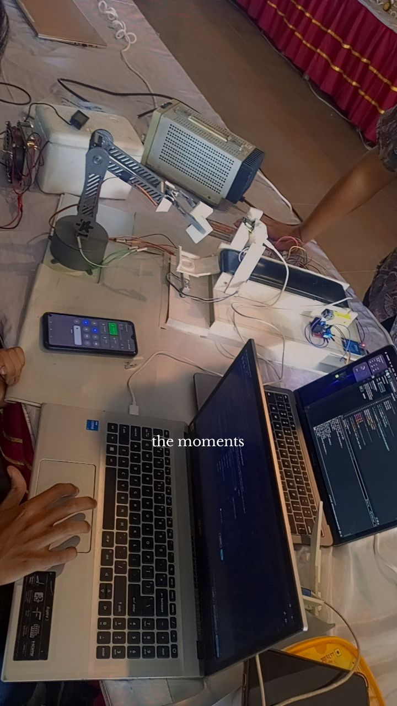
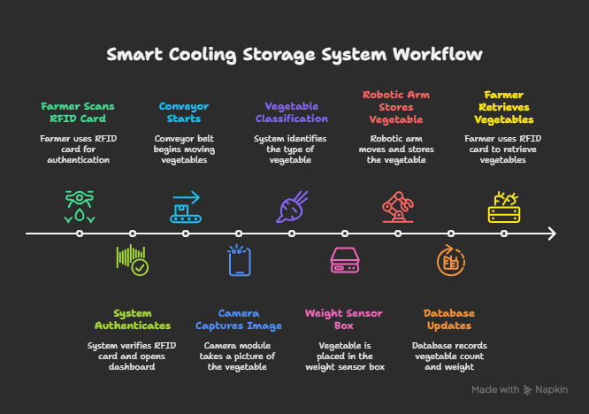

# 🥦 Cooling Storage System for Vegetables — Smart Farm Fresh Storage 🌾

### 🚜 “Keeping farmers’ harvests fresh, smart, and sustainable.”

---

## 🌱 Project Overview

The **Cooling Storage System** is an **IoT-based smart refrigeration and automation project** designed to help farmers **store their vegetables fresh for a long time** — especially **non-seasonal produce**.  

Our goal is to minimize post-harvest losses and give farmers a **personalized cold-storage solution** powered by **automation, sensors, and real-time dashboards**.

---

## 💡 Motivation

Each year, thousands of kilograms of vegetables spoil due to **lack of proper cold-storage facilities** in rural areas.  
We wanted to create an **affordable, intelligent, and scalable system** that:
- Keeps vegetables fresh longer
- Automatically classifies and stores them
- Provides farmers with **digital monitoring and retrieval** using RFID and smart dashboards

---

## ⚙️ Features

| No | Feature | Description |
|----|----------|-------------|
| 1️⃣ | **Cooling Storage Fridge** | Maintains optimal temperature to preserve freshness. |
| 2️⃣ | **Automated Conveyor System** | Transfers vegetables for storage and retrieval automatically. |
| 3️⃣ | **Robotic Arm (Movable)** | Places vegetables in their correct compartments inside the fridge. |
| 4️⃣ | **Vegetable Classification (Camera Module)** | Uses image processing to identify vegetable types. |
| 5️⃣ | **Weight Sensor** | Measures total weight of each classified vegetable and updates the central database. |
| 6️⃣ | **Smart Farmer Dashboard** | Displays vegetable data (weight, count, retrievals, storage history) after RFID authentication. |

---

## 🧠 System Workflow

### 🌾 Step-by-Step Working Flow

1️⃣ **Farmer Access & Authentication**  
   - Farmer scans RFID card on system.  
   - Dashboard automatically redirects to the farmer’s personal panel.  

2️⃣ **Vegetable Intake & Classification**  
   - Conveyor starts moving vegetables.  
   - Camera module captures images and classifies them by type.  
   - Conveyor places each type into a weight-sensor-equipped box.

3️⃣ **Weight Reading & Database Update**  
   - Weight sensor records total mass of vegetables per category.  
   - System updates **central database** with vegetable name, weight, and count.

4️⃣ **Storage by Robotic Arm**  
   - Robotic arm picks up each box and stores vegetables in the correct fridge compartment.

5️⃣ **Retrieval Process**  
   - Farmer scans RFID again.  
   - Dashboard shows stored vegetables.  
   - System retrieves the selected vegetables: arm picks them, conveyor delivers them back to the farmer.

---

## 🧩 System Components

- 🧊 Cooling Chamber (Fridge)
- ⚙️ Conveyor Belt System
- 🤖 Robotic Arm (Servo/Motor Controlled)
- 📸 Camera Module (for classification)
- ⚖️ Load/Weight Sensors
- 💾 Database (e.g., Firebase / MySQL)
- 🖥️ Dashboard Interface (with RFID authentication)
- 🪪 RFID Module
- 💡 Microcontroller (e.g., Raspberry Pi / Arduino)

---

## 🖥️ Dashboard Overview

The dashboard provides:
- ✅ Real-time vegetable count and weight  
- 📊 Daily store/retrieve statistics  
- 🔄 Compartment management visualization  
- 🔐 Secure RFID-based farmer login  

> **Homepage → RFID Scan → Farmer’s Personal Dashboard**

---

## 🎥 Project Demo

### 📸 System Prototype

### ⚙️ Workflow Diagram

### 🤖 Robotic Arm in Action

### 🧊 Cooling Storage in Operation

### 📹 Watch Our Demo Video  
🎬 [Watch on YouTube](https://youtu.be/your-demo-link)  
🎥 [Full Demonstration Video](videos/full_demo.mp4)

---

## 🧑‍🌾 Example Farmer Dashboard

| Farmer Name | Total Vegetables | Total Weight | Retrieved Today | Stored Today |
|--------------|------------------|---------------|-----------------|---------------|
| Rahim | 58 | 42.6 kg | 10 | 5 |
| Karim | 74 | 53.2 kg | 6 | 9 |

---

## 🛠️ Technologies Used

| Category | Tools/Hardware |
|-----------|----------------|
| 🧠 **Microcontroller** | Arduino / Raspberry Pi |
| 🧰 **Sensors** | Load Cell (HX711), RFID RC522 |
| 🎥 **Camera Module** | OpenCV / TensorFlow for classification |
| ⚙️ **Motors** | Servo Motor / Stepper Motor |
| 💻 **Backend** | Python / Node.js |
| 🗃️ **Database** | MySQL / Firebase |
| 🖥️ **Dashboard** | HTML, CSS, JavaScript, Flask / React |
| 📡 **Communication** | Serial / MQTT |

---

## 🏆 Impact

- Helps **reduce post-harvest waste**
- Enables **rural farmers to access smart storage**
- Encourages **digital farming practices**
- Promotes **sustainable food preservation**

---

## 🚀 Future Improvements

- Add **temperature/humidity control** with feedback sensors  
- Integrate **AI-based freshness detection**  
- Enable **cloud-based farmer analytics dashboard**  
- Support **voice control / mobile app interface**

---

## 👩‍💻 Contributors

| Name | Role |
|------|------|
| 👨‍🔧 [S M Mahbub Uddin] | Project Lead & Hardware Integration |
| 👩‍💻 [Fayjullah Haque] | Software & Dashboard Developer |
| 🤖 [Mehrin Ahmed] | Robotics Arm & Conveyor Control |
| 🧠 [Nur Jahan kamal] | Machine Learning (Vegetable Classification) |
| 🧠 [Shagin Ahmed Al Rahim] | Machine Learning (Vegetable Classification) |

---

## 📬 Contact
For any queries, please reach out via email:

- 📧 shamed221068@bscse.uiu.ac.bd
- 📧 mchowdhury221075@bscse.uiu.ac.bd
🌐 Project Page: [Live Link]([https://github.com/hrid0yyy/CropCell](https://cropcell.vercel.app/))

---

> **“Smart storage, smarter farming.”**  
> Keeping freshness alive — one vegetable at a time. 🥬💧

---
